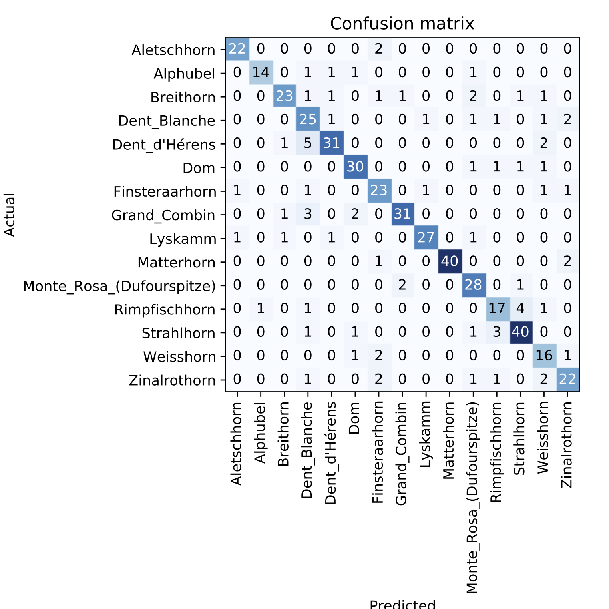

# Swiss_Mountain_app
Development of an app for the identification of swiss mountains. Wondering what peak you are facing while hiking in the swiss Alps? Take a picture with your cellphone and find out!

# To Do
### Data Collection

- [x] Collect image URLs with javascript.
- [x] Automatically download into folders.
- [x] Scrap Wikipedia table of swiss mountains with bs4.
- [x] Create bot to automate above steps with Selenium.
- [x] Expand number of available mountains.

### Data Cleaning and Augmentation

- [x] Check for image duplicates, irrelevant images, etc.
- [x] Balance classes (oversampling).
- [x] Data Augmentation.

### Model/Training

- [x] Download pretrained ResNet model, re-train to new data, re-train with dynamic image re-sizing.

### Deployment

- [x] Use Starlette to deploy model.

# File explanation

The model is ```export.pkl``` - a 103MB file.  
The notebook ```Training.ipynb``` contains the training steps of the model.  
The ```app.py``` file runs the model in your browser (see Deployment section).

# Remarks 

### Data Collection

The bot was created using Selenium to crawl google images for a given search. It is programmed to scroll down to the end of the current page to display the maximum amount of images. Then the javascript code fetches the image urls.

### Data Cleaning

A big challenge of this project was the data cleaning (as always...), but using a pretrained ImageNet model allowed to reduce the number of images per class to 150-200 (they could probably have been even less) for model fine-tuning. Scraping the data from Google images was a simple task but ensuring proper labeling was tricky as many mountains look alike and I am by no means a mountain expert. Not all images contained nice angles of mountains, and I had to manually remove selfies, photos with weird angles (from the peak, looking downwards, etc.). I tried to keep photos with good angles and lighting that (taken from the base of the mountain or from a neighbouring peak). Cleaning the data significantly improved model test accuracy to 84%, although we are not achieving the 95%+ accuracy for some more famous "toy" datasets. This is certainly due to the fact that classifying mountains is a difficult task as the mountains mostly have the same textures (snow, rock or grass), similar shapes and that some images can contain multiple mountains/labels depending on the angle of the photo.

### Model Training

The model was trained on a GPU for 40 epochs on the raw dataset. Then it was trained for 6 epochs on the clean dataset with different learning rate schedulers. In both cases, the head was first trained until the validation loss started to increase, then the body was trained using the same logic. Progressive image resizing didn't seem to help much (112px-> 224px -> 448px).  

### Interpretation

The heatmap feature implemented in the fastai library (https://openaccess.thecvf.com/content_ICCV_2017/papers/Selvaraju_Grad-CAM_Visual_Explanations_ICCV_2017_paper.pdf) shows that the biggest errors are made when the model focuses on "irrelevant" parts of the images. A segmentation based approach combined with better image cleaning could improve model predictions.  

{:height="250px" width="250px"}

### Deployment

The model is deployed using Starlette. You can run the app with ```uvicorn app:app```. You can then upload a mountain image (usual formats accepted) and the model will give you its prediction.

### Next Steps

In the next steps, it would be interesting to use a semantic segmentation model to pre-process the data and allow the network to focus solely on mountains and their contours/shapes. I am also thinking about using a pre-training model to check the labelling of images and increase the dataset size. A multilabel approach could also be considered since some images contain multiple mountains, but I don't have enough knowledge to label the data manually.
